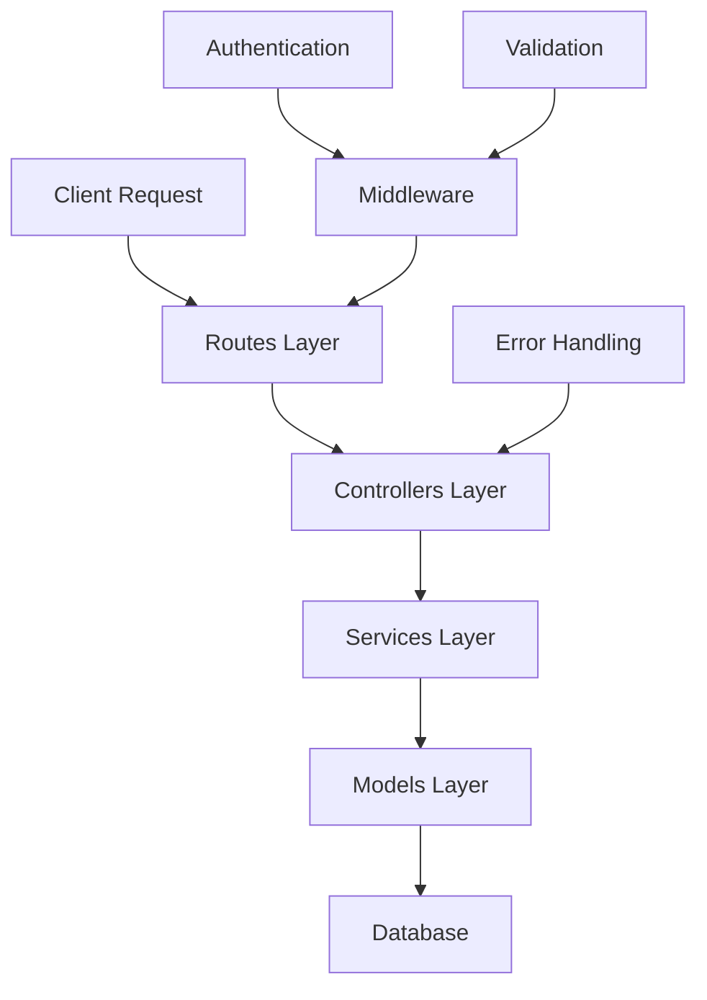
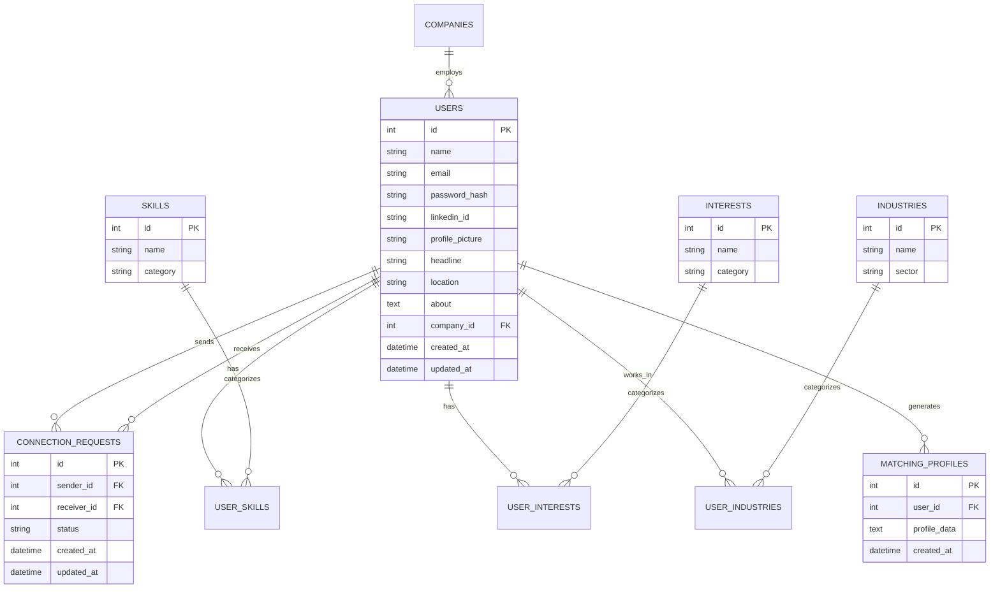
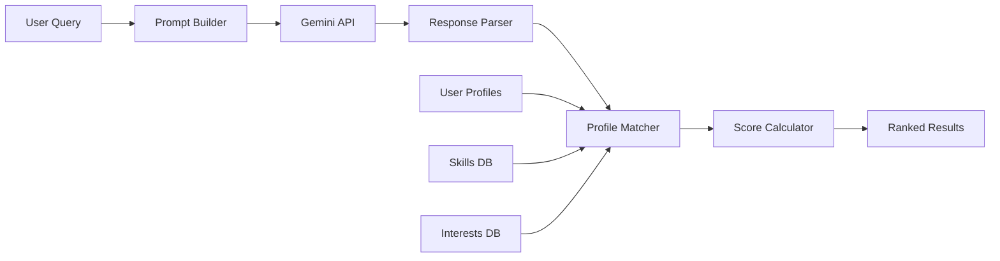

# Community Project Server

<p align="center">
  
  
  
  
  
</p>

<p align="center">
  <strong>A professional networking platform backend built with Node.js and Express, featuring AI-powered user recommendations, LinkedIn OAuth integration, and comprehensive connection management.</strong>
</p>

<p align="center">
  <a href="#-quick-start">Quick Start</a> •
  <a href="#-api-documentation">API Docs</a> •
  <a href="#-features">Features</a> •
  <a href="#-architecture">Architecture</a> •
  <a href="#-contributing">Contributing</a>
</p>

## 🚀 Features

### 🔐 Authentication & Security

- **JWT-based authentication** with secure token management
- **LinkedIn OAuth integration** for seamless social login
- **Role-based access control** (Admin and regular user roles)
- **Password encryption** using bcrypt with salt rounds
- **Request validation** and input sanitization

### 👥 Professional Networking

- **User profile management** with professional photos from RandomUser.me
- **Connection request system** with pending/accepted/rejected states
- **Bidirectional connection management** (send, accept, reject, remove)
- **Skills, interests, and industry categorization** with many-to-many relationships
- **Professional photo integration** for enhanced user experience

### 🤖 AI-Powered Recommendations

- **Google Gemini API integration** for intelligent matching
- **Profile-based user matching** analyzing skills and interests
- **Natural language query processing** for recommendation requests
- **Personalized connection suggestions** based on professional compatibility
- **Smart recommendation filtering** to avoid duplicate suggestions

### 💾 Database Management

- **SQLite with WAL journal mode** for optimal concurrent access
- **Comprehensive relational schema** with proper foreign key constraints
- **Better-sqlite3** for high-performance database operations
- **Automatic table creation** and schema management
- **Database connection pooling** and error recovery

## 📋 Table of Contents

- [🚀 Features](#-features)
- [🏗️ Architecture](#-architecture)
- [📊 Database Schema](#-database-schema)
- [🛠️ Tech Stack](#-tech-stack)
- [⚙️ Quick Start](#-quick-start)
- [📡 API Documentation](#-api-documentation)
- [🤖 AI Integration](#-ai-integration)
- [🔐 Authentication](#-authentication)
- [🧪 Development](#-development)
- [🚀 Deployment](#-deployment)
- [🤝 Contributing](#-contributing)
- [📄 License](#-license)

## 🏗️ Architecture

### 📁 Project Structure

```
community-project-server/
├── 📄 index.js                     # Application entry point & server setup
├── 📄 package.json                 # Dependencies and npm scripts
├── 🗄️ community.db                 # SQLite database file
├── 🗄️ community.db-shm             # SQLite shared memory file
├── 🗄️ community.db-wal             # SQLite write-ahead log
├── 📁 src/
│   ├── 📁 BL/                      # Business Logic Layer
│   │   ├── 📁 services/            # Core business services
│   │   │   ├── connection.service.js
│   │   │   ├── gemini.service.js
│   │   │   ├── geminiApi.service.js
│   │   │   ├── matchingProfiles.service.js
│   │   │   ├── recommendationBuilder.service.js
│   │   │   └── user.service.js
│   │   └── 📁 utils/               # Utility functions
│   │       ├── auth.js             # Authentication utilities
│   │       ├── errorHandler.js     # Error handling middleware
│   │       ├── geminiPromptBuilder.js
│   │       ├── geminiResponseParser.js
│   │       ├── jsonParser.js
│   │       └── requestValidator.js
│   ├── 📁 DL/                      # Data Layer
│   │   ├── 📄 DB.js                # Database connection & setup
│   │   ├── 📁 controllers/         # Database operations
│   │   │   ├── ConnectionRequests.controller.js
│   │   │   ├── industries.controller.js
│   │   │   ├── interests.controller.js
│   │   │   ├── MatchingProfiles.controller.js
│   │   │   ├── skills.controller.js
│   │   │   └── user.controller.js
│   │   └── 📁 models/              # Database models & schema
│   │       ├── community.model.js
│   │       ├── companies.model.js
│   │       ├── connection_requests.model.js
│   │       ├── industries.model.js
│   │       ├── interests.model.js
│   │       ├── matching_profiles.model.js
│   │       ├── skills.model.js
│   │       └── user.model.js
│   ├── 📁 routes/                  # API route definitions
│   │   ├── ai-recommendations.route.js
│   │   ├── auth.route.js
│   │   ├── connection-requests.route.js
│   │   ├── connections.route.js
│   │   └── user.route.js
│   └── 📁 data/                    # Data management
│       └── 📁 fakeData/            # Development seed data
```

### 🎯 MVC Architecture Pattern



- **Routes**: RESTful API endpoints and request routing
- **Controllers**: Database operations and data access logic
- **Services**: Business logic and external API integrations
- **Models**: Database schema definitions and table management
- **Middleware**: Authentication, validation, error handling

## 📊 Database Schema

### 🔗 Entity Relationship Diagram



### 🗂️ Table Descriptions

| Table                   | Purpose                    | Key Features                                 |
| ----------------------- | -------------------------- | -------------------------------------------- |
| **users**               | Core user profiles         | LinkedIn integration, professional photos    |
| **connection_requests** | Manage networking requests | Status tracking, bidirectional relationships |
| **skills**              | Skill categorization       | Hierarchical skill organization              |
| **interests**           | Interest tracking          | Professional interest mapping                |
| **industries**          | Industry classification    | Sector-based organization                    |
| **companies**           | Company information        | Employer relationship management             |
| **matching_profiles**   | AI recommendation data     | Gemini AI integration profiles               |

## 🛠️ Tech Stack

### 🚀 Backend Technologies

| Technology         | Version | Purpose                        |
| ------------------ | ------- | ------------------------------ |
| **Node.js**        | ^18.0.0 | JavaScript runtime environment |
| **Express.js**     | ^5.1.0  | Web application framework      |
| **SQLite**         | Latest  | Lightweight database system    |
| **better-sqlite3** | ^12.2.0 | High-performance SQLite driver |

### 🔐 Security & Authentication

| Package          | Version | Purpose                         |
| ---------------- | ------- | ------------------------------- |
| **jsonwebtoken** | ^9.0.2  | JWT token generation/validation |
| **bcrypt**       | ^6.0.0  | Password hashing and salting    |
| **cors**         | ^2.8.5  | Cross-origin resource sharing   |

### 🤖 AI & External APIs

| Service            | Purpose               | Integration                   |
| ------------------ | --------------------- | ----------------------------- |
| **Google Gemini**  | AI recommendations    | @google/generative-ai ^0.21.0 |
| **LinkedIn OAuth** | Social authentication | Custom implementation         |
| **RandomUser.me**  | Professional photos   | HTTP API integration          |

### 🛠️ Development Tools

| Tool           | Purpose                         |
| -------------- | ------------------------------- |
| **dotenv**     | Environment variable management |
| **axios**      | HTTP client for external APIs   |
| **node-fetch** | Fetch API for Node.js           |
| **nodemon**    | Development file watching       |

## ⚙️ Quick Start

### 📋 Prerequisites

Before you begin, ensure you have the following installed:

- **Node.js** (v18.0.0 or higher) - [Download here](https://nodejs.org/)
- **npm** (v8.0.0 or higher) - Comes with Node.js
- **Git** - [Download here](https://git-scm.com/)

### 🚀 Installation

1. **Clone the repository**

   ```pwsh
   git clone https://github.com/YonatanAriel/community-project-server.git
   cd "community project server"
   ```

2. **Install dependencies**

   ```pwsh
   npm install
   ```

3. **Environment Configuration**

   Create a `.env` file in the root directory:

   ```env
   # Server Configuration
   PORT=4000
   NODE_ENV=development

   # Authentication
   JWT_SECRET=your_super_secure_jwt_secret_key_here
   JWT_EXPIRES_IN=7d

   # LinkedIn OAuth (Optional)
   LINKEDIN_CLIENT_ID=your_linkedin_client_id
   LINKEDIN_CLIENT_SECRET=your_linkedin_client_secret
   LINKEDIN_REDIRECT_URI=http://localhost:4000/auth/linkedin/callback

   # Google Gemini AI
   GEMINI_API_KEY=your_google_gemini_api_key

   # Database
   DB_PATH=./community.db
   DB_WAL_MODE=true

   # CORS
   FRONTEND_URL=http://localhost:5173
   ```

4. **Initialize the database**

   ```pwsh
   # The database will be automatically created on first run
   npm run dev
   ```

5. **Access the application**
   - Server: `http://localhost:4000`
   - API Documentation: `http://localhost:4000/api/docs` (if implemented)

### 🔧 Development Scripts

```pwsh
# Start development server with hot reload
npm run dev

# Start production server
npm start

# Run tests (when implemented)
npm test

# Build for production (when implemented)
npm run build
```

## 📡 API Documentation

### 🔐 Authentication Endpoints

#### User Registration

```http
POST /auth/register
Content-Type: application/json

{
  "name": "John Doe",
  "email": "john.doe@example.com",
  "password": "securePassword123",
  "headline": "Software Engineer",
  "location": "San Francisco, CA"
}
```

**Response:**

```json
{
  "success": true,
  "message": "User registered successfully",
  "data": {
    "user": {
      "id": 1,
      "name": "John Doe",
      "email": "john.doe@example.com",
      "headline": "Software Engineer"
    },
    "token": "eyJhbGciOiJIUzI1NiIsInR5cCI6IkpXVCJ9..."
  }
}
```

#### User Login

```http
POST /auth/login
Content-Type: application/json

{
  "email": "john.doe@example.com",
  "password": "securePassword123"
}
```

#### LinkedIn OAuth

```http
GET /auth/linkedin
# Redirects to LinkedIn OAuth flow

GET /auth/linkedin/callback?code=AUTH_CODE
# Handles LinkedIn callback and creates/logs in user
```

### 👥 User Management Endpoints

#### Get User Profile

```http
GET /user/:id
Authorization: Bearer {token}
```

#### Update User Profile

```http
PUT /user/:id
Authorization: Bearer {token}
Content-Type: application/json

{
  "name": "John Smith",
  "headline": "Senior Software Engineer",
  "about": "Passionate developer with 5+ years experience",
  "location": "New York, NY"
}
```

### 🔗 Connection Management Endpoints

#### Send Connection Request

```http
POST /connection-requests
Authorization: Bearer {token}
Content-Type: application/json

{
  "receiverId": 2,
  "message": "I'd like to connect with you!"
}
```

#### Get Connection Requests

```http
GET /connection-requests/:userId
Authorization: Bearer {token}

# Query parameters:
# ?status=pending|accepted|rejected
# ?type=sent|received
```

#### Accept/Reject Connection Request

```http
PUT /connection-requests/:requestId
Authorization: Bearer {token}
Content-Type: application/json

{
  "status": "accepted" // or "rejected"
}
```

#### Get User Connections

```http
GET /connections/:userId
Authorization: Bearer {token}
```

#### Remove Connection

```http
DELETE /connections/:connectionId
Authorization: Bearer {token}
```

### 🤖 AI Recommendations Endpoints

#### Get AI Recommendations

```http
POST /ai-recommendations
Authorization: Bearer {token}
Content-Type: application/json

{
  "userId": 1,
  "query": "Find me software engineers interested in machine learning",
  "limit": 10
}
```

**Response:**

```json
{
  "success": true,
  "data": {
    "recommendations": [
      {
        "id": 5,
        "name": "Alice Johnson",
        "headline": "ML Engineer at TechCorp",
        "skills": ["Python", "TensorFlow", "Machine Learning"],
        "matchScore": 0.95,
        "reason": "Strong match in ML skills and interests"
      }
    ],
    "total": 5,
    "query": "Find me software engineers interested in machine learning"
  }
}
```

### 🏷️ Skills, Interests & Industries

#### Get Skills

```http
GET /skills
# Optional query: ?category=technical|soft|language
```

#### Get Interests

```http
GET /interests
# Optional query: ?category=professional|personal|industry
```

#### Get Industries

```http
GET /industries
# Optional query: ?sector=technology|finance|healthcare
```

## 🤖 AI Integration

### 🧠 Google Gemini AI Features

The platform leverages Google's Gemini AI to provide intelligent networking recommendations:

#### **Profile Analysis**

- Analyzes user skills, interests, and industry background
- Creates semantic embeddings of professional profiles
- Identifies compatibility patterns between users

#### **Smart Matching Algorithm**

```javascript
// Example recommendation flow
const recommendations = await geminiService.getRecommendations({
  userId: 1,
  query: "Find software engineers with AI/ML experience in San Francisco",
  filters: {
    location: "San Francisco, CA",
    skills: ["Machine Learning", "Python", "TensorFlow"],
    industries: ["Technology", "AI/ML"],
  },
  limit: 10,
});
```

#### **Natural Language Processing**

- Processes complex recommendation queries in natural language
- Understands context and intent behind connection requests
- Provides reasoning for each recommendation

#### **Recommendation Quality**

- **Match Scoring**: 0.0 to 1.0 compatibility score
- **Reasoning**: AI-generated explanation for each match
- **Diversity**: Ensures varied recommendations across different criteria
- **Freshness**: Prioritizes recently active users

### 🔧 AI Service Architecture



## 🔐 Authentication

### 🔑 JWT Authentication Flow

```mermaid
sequenceDigram
    participant C as Client
    participant S as Server
    participant DB as Database

    C->>S: POST /auth/login (email, password)
    S->>DB: Validate user credentials
    DB-->>S: User data
    S->>S: Generate JWT token
    S-->>C: JWT token + user data

    C->>S: API Request + Authorization header
    S->>S: Verify JWT token
    S->>DB: Execute request
    DB-->>S: Response data
    S-->>C: API response
```

#### **Token Structure**

```javascript
{
  "user": {
    "id": 1,
    "email": "user@example.com",
    "role": "user" // or "admin"
  },
  "iat": 1640995200,
  "exp": 1641600000
}
```

### 🔗 LinkedIn OAuth Integration

#### **OAuth Flow**

1. **Initiation**: `GET /auth/linkedin`
2. **Authorization**: Redirect to LinkedIn
3. **Callback**: `GET /auth/linkedin/callback`
4. **Profile Fetch**: Retrieve LinkedIn profile data
5. **Account Creation**: Create or update user account
6. **Token Generation**: Issue JWT for session management

#### **LinkedIn Profile Mapping**

```javascript
const linkedinProfile = {
  id: linkedin.id,
  name: linkedin.localizedFirstName + " " + linkedin.localizedLastName,
  email: linkedin.emailAddress,
  headline: linkedin.headline,
  location: linkedin.location.name,
  profilePicture: linkedin.profilePicture,
  industry: linkedin.industry,
};
```

### 🛡️ Security Measures

- **Password Hashing**: bcrypt with 12 salt rounds
- **Token Expiration**: 7-day JWT expiration by default
- **Request Validation**: Input sanitization and validation
- **CORS Protection**: Configured for specific origins
- **Rate Limiting**: (Recommended for production)
- **SQL Injection Prevention**: Parameterized queries only

## 🧪 Development

### 🎯 Development Setup

#### **Fake Data Generation**

```pwsh
# Generate sample users with professional photos
npm run seed:users

# Generate sample connections
npm run seed:connections

# Generate complete test dataset
npm run seed:all
```

#### **Database Development**

```javascript
// Database utilities available in development
const db = require("./src/DL/DB.js");

// Inspect tables
console.log(db.getAllTables());

// Reset database
db.resetDatabase();

// Backup database
db.backupDatabase("./backup.db");
```

### 🔧 Debugging Tools

#### **Logging Configuration**

```javascript
// Enable verbose database logging
process.env.DB_VERBOSE = "true";

// Service-level logging
const logger = require("./src/BL/utils/logger");
logger.info("Service operation completed");
logger.error("Service operation failed", error);
```

#### **Development Endpoints**

```http
# Development only - get all users
GET /dev/users
Authorization: Bearer {admin_token}

# Development only - reset database
POST /dev/reset-db
Authorization: Bearer {admin_token}

# Development only - generate fake data
POST /dev/seed/:count
Authorization: Bearer {admin_token}
```

### 🧪 Testing Strategy

#### **Unit Testing** (Recommended)

```javascript
// Example service test
describe("UserService", () => {
  test("should create user with valid data", async () => {
    const userData = {
      name: "Test User",
      email: "test@example.com",
      password: "password123",
    };

    const user = await userService.createUser(userData);
    expect(user.id).toBeDefined();
    expect(user.email).toBe(userData.email);
  });
});
```

#### **Integration Testing** (Recommended)

```javascript
// Example API endpoint test
describe("POST /auth/register", () => {
  test("should register new user successfully", async () => {
    const response = await request(app)
      .post("/auth/register")
      .send({
        name: "John Doe",
        email: "john@example.com",
        password: "password123",
      })
      .expect(201);

    expect(response.body.success).toBe(true);
    expect(response.body.data.token).toBeDefined();
  });
});
```

## 🚀 Deployment

### 🐳 Docker Deployment

#### **Dockerfile**

```dockerfile
FROM node:18-alpine

WORKDIR /app

COPY package*.json ./
RUN npm ci --only=production

COPY . .

EXPOSE 4000

CMD ["npm", "start"]
```

#### **Docker Compose**

```yaml
version: "3.8"
services:
  community-server:
    build: .
    ports:
      - "4000:4000"
    environment:
      - NODE_ENV=production
      - PORT=4000
    volumes:
      - ./data:/app/data
    restart: unless-stopped
```

### ☁️ Cloud Deployment Options

#### **Railway** (Recommended for beginners)

```pwsh
# Install Railway CLI
npm install -g @railway/cli

# Login and deploy
railway login
railway init
railway up
```

#### **Heroku**

```pwsh
# Create Heroku app
heroku create community-project-server

# Set environment variables
heroku config:set JWT_SECRET=your_secret
heroku config:set GEMINI_API_KEY=your_key

# Deploy
git push heroku main
```

#### **VPS Deployment**

```bash
# Using PM2 for process management
npm install -g pm2

# Start application
pm2 start index.js --name "community-server"

# Setup auto-restart
pm2 startup
pm2 save
```

### 🔧 Production Configuration

#### **Environment Variables**

```env
NODE_ENV=production
PORT=4000
JWT_SECRET=your_super_secure_production_secret
GEMINI_API_KEY=your_production_gemini_key
DB_PATH=/app/data/community.db
FRONTEND_URL=https://your-frontend-domain.com
```

#### **Performance Optimizations**

- Enable compression middleware
- Implement API rate limiting
- Use connection pooling
- Enable database WAL mode
- Implement caching strategy
- Monitor with APM tools

## 🤝 Contributing

We welcome contributions from the community! Here's how you can help improve the Community Project Server:

### 🚀 Getting Started

1. **Fork the repository**

   ```pwsh
   # Click the "Fork" button on GitHub, then clone your fork
   git clone https://github.com/YOUR_USERNAME/community-project-server.git
   cd "community project server"
   ```

2. **Set up development environment**

   ```pwsh
   npm install
   cp .env.example .env
   # Edit .env with your development values
   npm run dev
   ```

3. **Create a feature branch**
   ```pwsh
   git checkout -b feature/your-amazing-feature
   # Or for bug fixes:
   git checkout -b fix/bug-description
   ```

### 📝 Development Guidelines

#### **Code Style**

- Use ES6+ features and modern JavaScript
- Follow consistent naming conventions (camelCase)
- Add JSDoc comments for functions and classes
- Use meaningful variable and function names
- Keep functions small and focused

#### **Commit Messages**

Follow [Conventional Commits](https://www.conventionalcommits.org/):

```
feat: add user profile photo upload
fix: resolve connection request duplicate issue
docs: update API documentation
refactor: improve database connection handling
test: add unit tests for user service
```

#### **Code Structure**

- **Services**: Business logic and external API interactions
- **Controllers**: Database operations and data access
- **Models**: Database schema and table definitions
- **Utils**: Reusable helper functions
- **Routes**: API endpoint definitions

### 🧪 Testing Requirements

Before submitting a PR, ensure:

- [ ] All existing tests pass
- [ ] New features include appropriate tests
- [ ] API endpoints are tested
- [ ] Database operations are tested
- [ ] Error handling is tested

```pwsh
# Run tests (when implemented)
npm test

# Run linting
npm run lint

# Check code formatting
npm run format:check
```

### 📋 Pull Request Process

1. **Update documentation** if needed
2. **Add tests** for new functionality
3. **Update CHANGELOG.md** with your changes
4. **Submit pull request** with clear description

#### **PR Template**

```markdown
## Description

Brief description of changes

## Type of Change

- [ ] Bug fix
- [ ] New feature
- [ ] Breaking change
- [ ] Documentation update

## Testing

- [ ] Unit tests pass
- [ ] Integration tests pass
- [ ] Manual testing completed

## Checklist

- [ ] Code follows project style guidelines
- [ ] Self-review completed
- [ ] Documentation updated
- [ ] No breaking changes (or clearly documented)
```

### 🐛 Reporting Issues

When reporting bugs or requesting features:

1. **Check existing issues** first
2. **Use issue templates** if available
3. **Provide detailed information**:
   - Environment details (Node.js version, OS)
   - Steps to reproduce
   - Expected vs actual behavior
   - Screenshots if applicable

### 💡 Feature Requests

We're always looking for new ideas! Consider contributing:

- **New AI recommendation algorithms**
- **Enhanced user profile features**
- **Real-time messaging system**
- **Advanced search and filtering**
- **Mobile app integration**
- **Analytics and reporting**
- **Email notification system**
- **Video/voice calling integration**

### 🌟 Recognition

Contributors will be:

- Listed in the CONTRIBUTORS.md file
- Mentioned in release notes
- Given appropriate GitHub repository permissions
- Invited to the contributors' Discord server

## 📊 Performance & Monitoring

### 📈 Key Metrics

Monitor these important metrics in production:

| Metric           | Target  | Tool              |
| ---------------- | ------- | ----------------- |
| Response Time    | < 200ms | APM               |
| Database Queries | < 50ms  | SQLite logs       |
| Memory Usage     | < 512MB | System monitoring |
| Error Rate       | < 1%    | Error tracking    |
| Uptime           | > 99.9% | Health checks     |

### 🔍 Logging Strategy

```javascript
// Structured logging example
logger.info("User connection request", {
  userId: req.user.id,
  targetUserId: req.body.receiverId,
  requestId: uuid(),
  timestamp: new Date().toISOString(),
});
```

### 🚨 Error Monitoring

Recommended tools for production:

- **Sentry** - Error tracking and performance monitoring
- **Winston** - Advanced logging
- **New Relic** - Application performance monitoring
- **Datadog** - Infrastructure monitoring

## 🔧 Advanced Configuration

### 🗄️ Database Optimization

#### **SQLite Configuration**

```javascript
// Optimize SQLite for production
const db = new Database("community.db", {
  verbose: process.env.NODE_ENV === "development" ? console.log : null,
  fileMustExist: false,
});

// Enable WAL mode for better concurrency
db.pragma("journal_mode = WAL");
db.pragma("synchronous = NORMAL");
db.pragma("cache_size = 1000000");
db.pragma("temp_store = memory");
```

#### **Connection Pooling**

```javascript
// Implement connection pooling for high traffic
class DatabasePool {
  constructor(dbPath, poolSize = 10) {
    this.pool = [];
    this.poolSize = poolSize;

    for (let i = 0; i < poolSize; i++) {
      this.pool.push(new Database(dbPath));
    }
  }

  getConnection() {
    return this.pool[Math.floor(Math.random() * this.poolSize)];
  }
}
```

### 🔒 Security Hardening

#### **Rate Limiting**

```javascript
const rateLimit = require("express-rate-limit");

const limiter = rateLimit({
  windowMs: 15 * 60 * 1000, // 15 minutes
  max: 100, // limit each IP to 100 requests per windowMs
  message: "Too many requests from this IP",
  standardHeaders: true,
  legacyHeaders: false,
});

app.use("/api/", limiter);
```

#### **Security Headers**

```javascript
const helmet = require("helmet");
app.use(
  helmet({
    contentSecurityPolicy: {
      directives: {
        defaultSrc: ["'self'"],
        styleSrc: ["'self'", "'unsafe-inline'"],
        scriptSrc: ["'self'"],
        imgSrc: ["'self'", "data:", "https:"],
      },
    },
  })
);
```

## 📚 Resources & Documentation

### 📖 Additional Documentation

- [API Reference](./docs/API.md) - Complete API documentation
- [Database Schema](./docs/DATABASE.md) - Detailed database documentation
- [Deployment Guide](./docs/DEPLOYMENT.md) - Production deployment guide
- [Development Setup](./docs/DEVELOPMENT.md) - Local development setup

### 🔗 Useful Links

- [Express.js Documentation](https://expressjs.com/)
- [SQLite Documentation](https://www.sqlite.org/docs.html)
- [Google Gemini AI](https://ai.google.dev/)
- [JWT Best Practices](https://auth0.com/blog/a-look-at-the-latest-draft-for-jwt-bcp/)
- [Node.js Security Best Practices](https://nodejs.org/en/docs/guides/security/)

### 🎓 Learning Resources

- [RESTful API Design](https://restfulapi.net/)
- [Database Design Principles](https://www.tutorialspoint.com/dbms/dbms_overview.htm)
- [Node.js Performance Best Practices](https://nodejs.org/en/docs/guides/simple-profiling/)

## 📄 License

This project is licensed under the **ISC License**.

```
ISC License

Copyright (c) 2025 Yonatan Ariel

Permission to use, copy, modify, and/or distribute this software for any
purpose with or without fee is hereby granted, provided that the above
copyright notice and this permission notice appear in all copies.

THE SOFTWARE IS PROVIDED "AS IS" AND THE AUTHOR DISCLAIMS ALL WARRANTIES
WITH REGARD TO THIS SOFTWARE INCLUDING ALL IMPLIED WARRANTIES OF
MERCHANTABILITY AND FITNESS. IN NO EVENT SHALL THE AUTHOR BE LIABLE FOR
ANY SPECIAL, DIRECT, INDIRECT, OR CONSEQUENTIAL DAMAGES OR ANY DAMAGES
WHATSOEVER RESULTING FROM LOSS OF USE, DATA OR PROFITS, WHETHER IN AN
ACTION OF CONTRACT, NEGLIGENCE OR OTHER TORTIOUS ACTION, ARISING OUT OF
OR IN CONNECTION WITH THE USE OR PERFORMANCE OF THIS SOFTWARE.
```

## 🙏 Acknowledgments

Special thanks to the following projects and communities:

### 🛠️ Core Technologies

- **[Express.js](https://expressjs.com/)** - Fast, unopinionated web framework
- **[SQLite](https://www.sqlite.org/)** - Lightweight, reliable database engine
- **[Better SQLite3](https://github.com/WiseLibs/better-sqlite3)** - High-performance SQLite driver
- **[Google Gemini AI](https://ai.google.dev/)** - Advanced AI capabilities

### 🔐 Security & Authentication

- **[bcrypt](https://github.com/kelektiv/node.bcrypt.js)** - Secure password hashing
- **[jsonwebtoken](https://github.com/auth0/node-jsonwebtoken)** - JWT implementation
- **[LinkedIn Developer Platform](https://developer.linkedin.com/)** - OAuth integration

### 🌐 HTTP & Networking

- **[Axios](https://axios-http.com/)** - HTTP client library
- **[CORS](https://github.com/expressjs/cors)** - Cross-origin resource sharing
- **[dotenv](https://github.com/motdotla/dotenv)** - Environment variable management

### 👥 Community

- **Node.js Community** - For the amazing runtime and ecosystem
- **Express.js Community** - For the robust web framework
- **SQLite Community** - For the reliable database engine
- **GitHub Community** - For hosting and collaboration tools

---

<p align="center">
  <strong>Built with ❤️ by the Community Project Server Team</strong>
</p>

<p align="center">
  <a href="https://github.com/YonatanAriel/community-project-server">⭐ Star this repository</a> •
  <a href="https://github.com/YonatanAriel/community-project-server/issues">🐛 Report a bug</a> •
  <a href="https://github.com/YonatanAriel/community-project-server/discussions">💬 Discussions</a>
</p>
